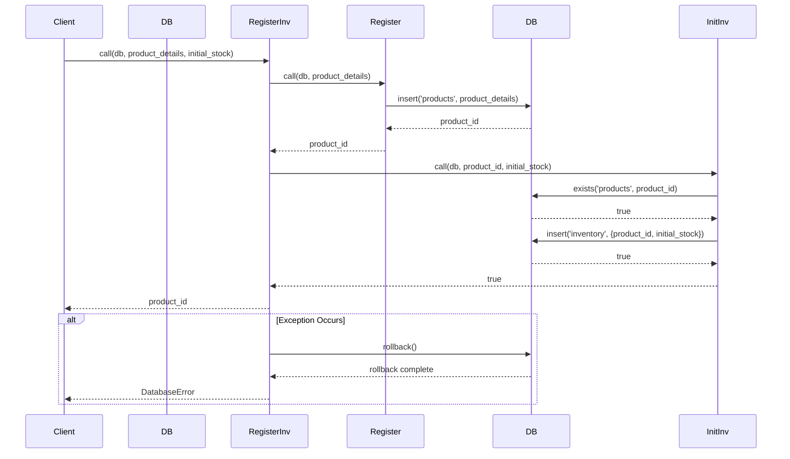
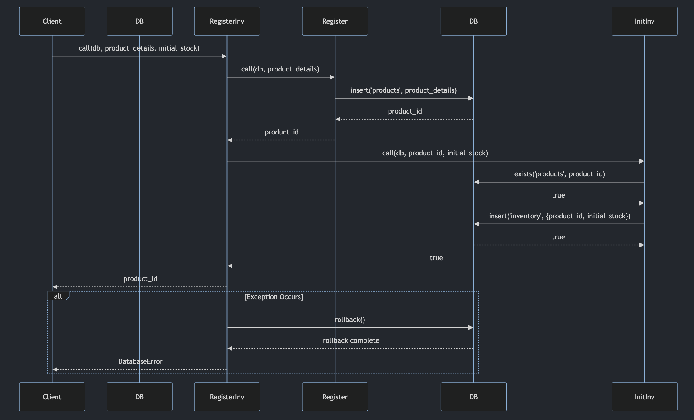

`/inventory.py` の構造を説明するためのシーケンス図です。
商品情報登録機能がクライアントから呼び出されるプログラム（API)ですが、実際は商品情報の登録と在庫の初期化をそれぞれ個別に行います。
このように役割を分担することでAPI本体の複雑さを抑え、保守性を高めることができます。
UnitX系のテストも、こうしたアプローチととても相性が良いです。

```mermaid
sequenceDiagram
    participant Client
    participant Database as DB

    Client->>RegisterInv: call(db, product_details, initial_stock)
    RegisterInv->>Register: call(db, product_details)
    Register->>DB: insert('products', product_details)
    DB-->>Register: product_id
    Register-->>RegisterInv: product_id
    RegisterInv->>InitInv: call(db, product_id, initial_stock)
    InitInv->>DB: exists('products', product_id)
    DB-->>InitInv: true
    InitInv->>DB: insert('inventory', {product_id, initial_stock})
    DB-->>InitInv: true
    InitInv-->>RegisterInv: true
    RegisterInv-->>Client: product_id
    alt Exception Occurs
        RegisterInv->>DB: rollback()
        DB-->>RegisterInv: rollback complete
        RegisterInv-->>Client: DatabaseError
    end
```

